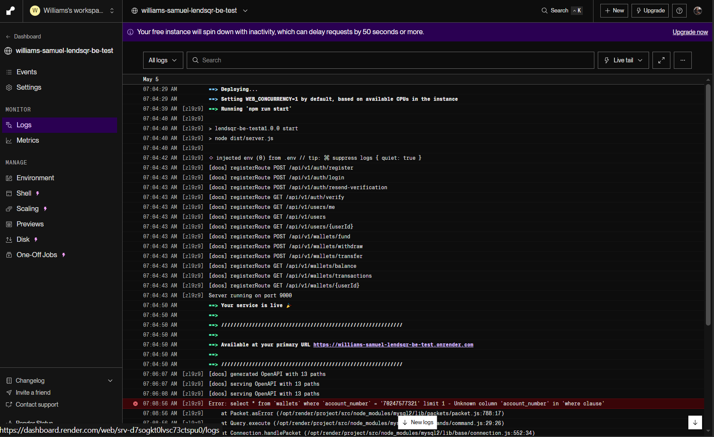
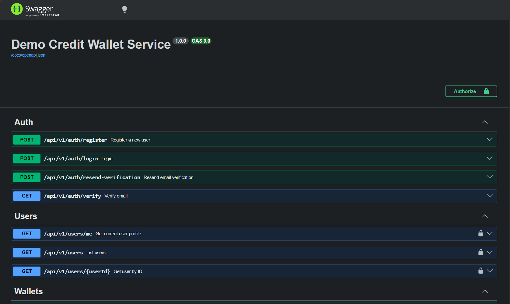

# Lendsqr Backend Engineering Assessment

Demo Credit wallet service built with Node.js, TypeScript, Express, Knex, and MySQL.

The API is live on Render:

- Base URL: [https://williams-samuel-lendsqr-be-test.onrender.com/](https://williams-samuel-lendsqr-be-test-lrbk.onrender.com)
- API docs: [https://williams-samuel-lendsqr-be-test.onrender.com/docs](https://williams-samuel-lendsqr-be-test-lrbk.onrender.com/docs)
- Health check: [https://williams-samuel-lendsqr-be-test.onrender.com/health](https://williams-samuel-lendsqr-be-test-lrbk.onrender.com/health)

## Overview

This project implements the MVP wallet service described in the Lendsqr backend engineering assessment. It supports user onboarding, Lendsqr Adjutor Karma blacklist checks, wallet funding, withdrawals, transfers, transaction history, email verification, and email notifications.

The wallet operations are implemented with database transactions and row-level wallet locks where money movement occurs. This protects balances from partial writes and race conditions during fund, withdrawal, and transfer operations.

## Features

- User registration with password hashing
- Lendsqr Adjutor Karma blacklist validation during onboarding
- Email verification flow
- JWT authentication with a configurable faux API token fallback
- Wallet creation for every onboarded user
- Unique 11-digit wallet account numbers
- Fund authenticated user's wallet
- Withdraw from authenticated user's wallet
- Transfer to another user by receiver user ID or receiver account number
- Transaction and transfer records
- Non-negative wallet balance constraint
- Email notifications for funding, withdrawal, received transfers, and successful login
- Swagger/OpenAPI documentation
- Unit tests for wallet behavior, schema validation, and email templates

## ERD


The DBML source is available at [src/db/db.dbml](src/db/db.dbml).

## Screenshots

### Live Render Deployment



### Swagger Documentation



## Tech Stack

- Node.js
- TypeScript
- Express
- Knex.js
- MySQL
- Zod
- Jest
- Argon2
- JSON Web Token
- Handlebars
- Swagger UI
- Lendsqr Adjutor API
- ZeptoMail

## Project Structure

```text
src/
  clients/          External API clients
  config/           Environment configuration
  controllers/      HTTP request handlers
  db/               Knex client and DBML
  docs/             OpenAPI registry and Swagger router
  email_templates/  Handlebars email templates
  middleware/       Auth, permission, and error middleware
  repositories/     Database access layer
  routes/           Express route definitions
  services/         Business logic
  types/            Shared TypeScript types
  utils/            Shared helpers
migrations/         Knex migrations
__tests__/          Jest tests
database-erd/       ERD image and DBML export
.docs/              Project screenshots
```

## Getting Started

### 1. Install dependencies

```bash
npm install
```

### 2. Configure environment variables

Copy `.env.example` to `.env` and fill in the values:

```bash
cp .env.example .env
```

Required values include:

- `DB_HOST`
- `DB_PORT`
- `DB_USER`
- `DB_PASSWORD`
- `DB_NAME`
- `JWT_SECRET`
- `ADJUTOR_BASE_URL`
- `ADJUTOR_API_KEY`
- `ZEPTOMAIL_API_KEY`
- `ZEPTOMAIL_FROM_ADDRESS`
- `ZEPTOMAIL_FROM_NAME`

### 3. Run migrations

```bash
npm run migrate
```

### 4. Start development server

```bash
npm run dev
```

### 5. Build

```bash
npm run build
```

### 6. Start compiled app

```bash
npm start
```

## API Summary

All versioned API routes are mounted under `/api/v1`.

### Auth

- `POST /api/v1/auth/register`
- `POST /api/v1/auth/login`
- `POST /api/v1/auth/resend-verification`
- `GET /api/v1/auth/verify?token=<token>`

### Users

- `GET /api/v1/users/me`
- `GET /api/v1/users`
- `GET /api/v1/users/:userId`

### Wallets

- `POST /api/v1/wallets/fund`
- `POST /api/v1/wallets/withdraw`
- `POST /api/v1/wallets/transfer`
- `GET /api/v1/wallets/balance`
- `GET /api/v1/wallets/transactions`
- `GET /api/v1/wallets/:userId`

## Authentication

Protected routes require a bearer token:

```http
Authorization: Bearer <token>
```

The app supports normal JWT login tokens and a configurable faux token through `API_TOKEN`.

## Wallet Requests

Fund wallet:

```json
{
  "amount": "1000.00"
}
```

Withdraw:

```json
{
  "amount": "250.00"
}
```

Transfer by account number:

```json
{
  "receiverAccountNumber": "12345678901",
  "amount": "500.00"
}
```

Transfer by user ID:

```json
{
  "receiverUserId": "user-uuid",
  "amount": "500.00"
}
```

Transfers must provide exactly one of `receiverAccountNumber` or `receiverUserId`.

## Testing

Run all tests:

```bash
npm test
```

Focused wallet tests:

```bash
npm test -- --runTestsByPath __tests__/wallet.service.test.ts
```

The wallet tests cover:

- Funding balance updates
- Funding transaction records
- Invalid funding amounts
- Withdrawal balance updates
- Insufficient withdrawal funds
- Protection against negative balances
- Transfer sender debit
- Transfer receiver credit
- Atomic transfer writes
- Rollback on insufficient balance
- Rollback on invalid receiver
- Rollback on mid-transaction database failure

## Documentation

For the detailed implementation review, design decisions, database notes, and requirement mapping, see [project-docs.md](project-docs.md).
